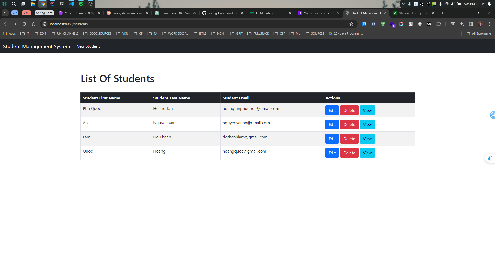
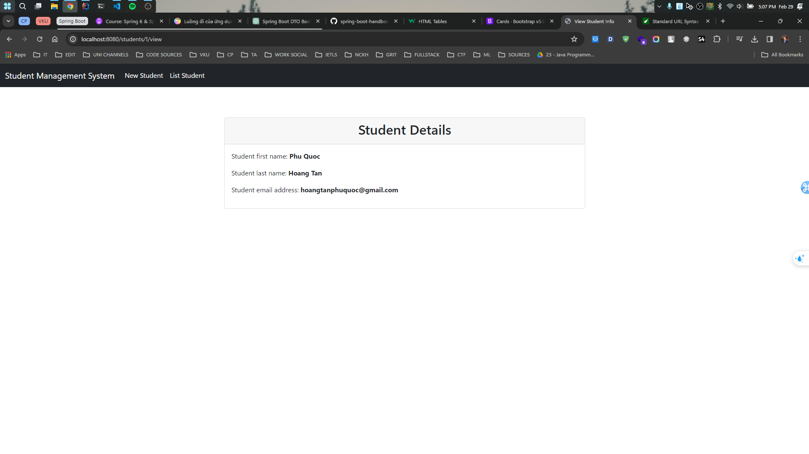
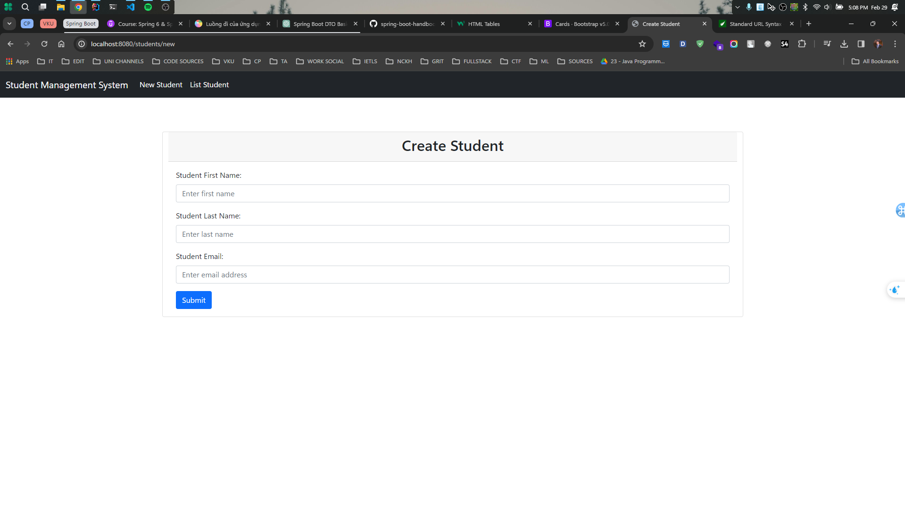
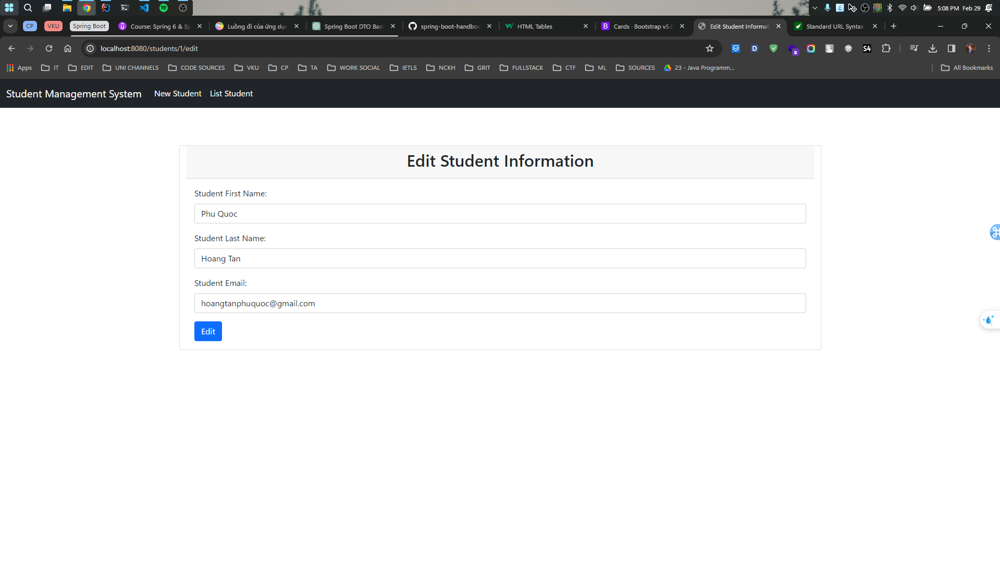
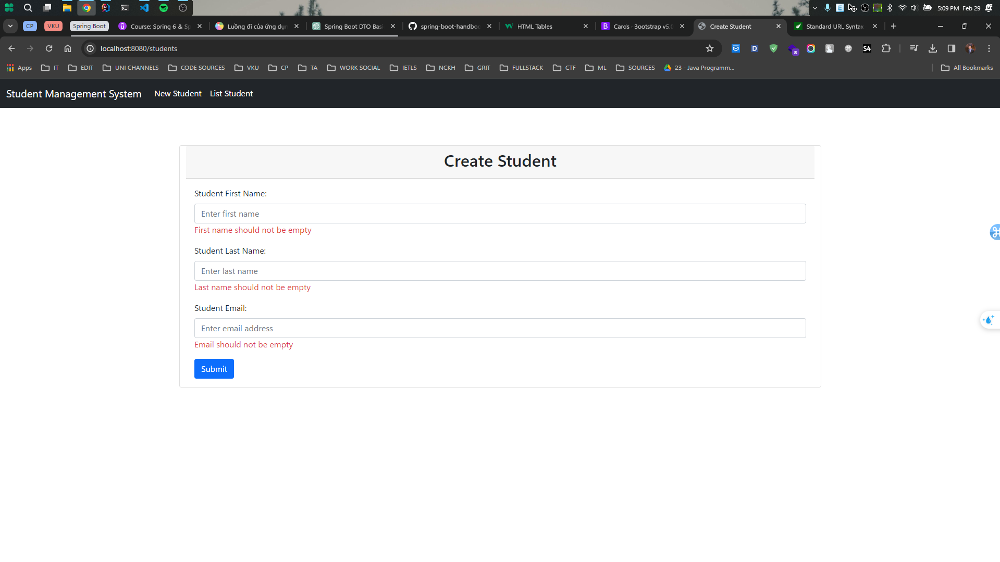

# STUDENT MANAGEMENT SYSTEM

### Reference Documentation

For further reference, please consider the following sections:

* [Official Apache Maven documentation](https://maven.apache.org/guides/index.html)
* [Spring Boot Maven Plugin Reference Guide](https://docs.spring.io/spring-boot/docs/3.2.3/maven-plugin/reference/html/)
* [Create an OCI image](https://docs.spring.io/spring-boot/docs/3.2.3/maven-plugin/reference/html/#build-image)
* [Spring Web](https://docs.spring.io/spring-boot/docs/3.2.3/reference/htmlsingle/index.html#web)
* [Thymeleaf](https://docs.spring.io/spring-boot/docs/3.2.3/reference/htmlsingle/index.html#web.servlet.spring-mvc.template-engines)
* [Validation](https://docs.spring.io/spring-boot/docs/3.2.3/reference/htmlsingle/index.html#io.validation)
* [Spring Data JPA](https://docs.spring.io/spring-boot/docs/3.2.3/reference/htmlsingle/index.html#data.sql.jpa-and-spring-data)

### Guides

The following guides illustrate how to use some features concretely:

* [Accessing data with MySQL](https://spring.io/guides/gs/accessing-data-mysql/)
* [Building a RESTful Web Service](https://spring.io/guides/gs/rest-service/)
* [Serving Web Content with Spring MVC](https://spring.io/guides/gs/serving-web-content/)
* [Building REST services with Spring](https://spring.io/guides/tutorials/rest/)
* [Handling Form Submission](https://spring.io/guides/gs/handling-form-submission/)
* [Validation](https://spring.io/guides/gs/validating-form-input/)
* [Accessing Data with JPA](https://spring.io/guides/gs/accessing-data-jpa/)

### Student Management System 
#### List of student

#### View Student Info

#### New Student

#### Edit Student Info

#### Delete Student

#### Validation

